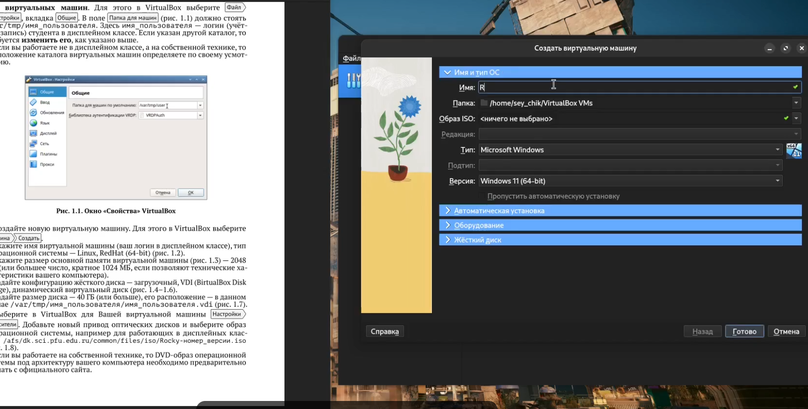
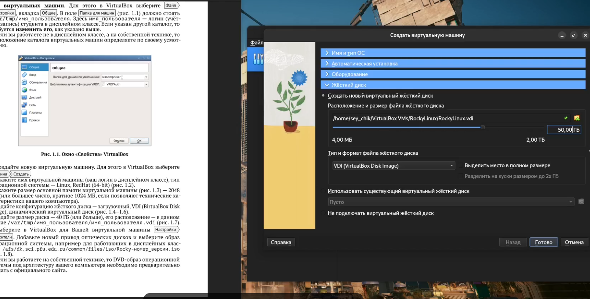
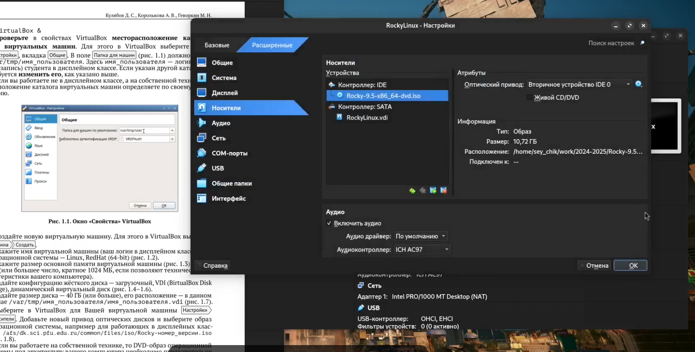
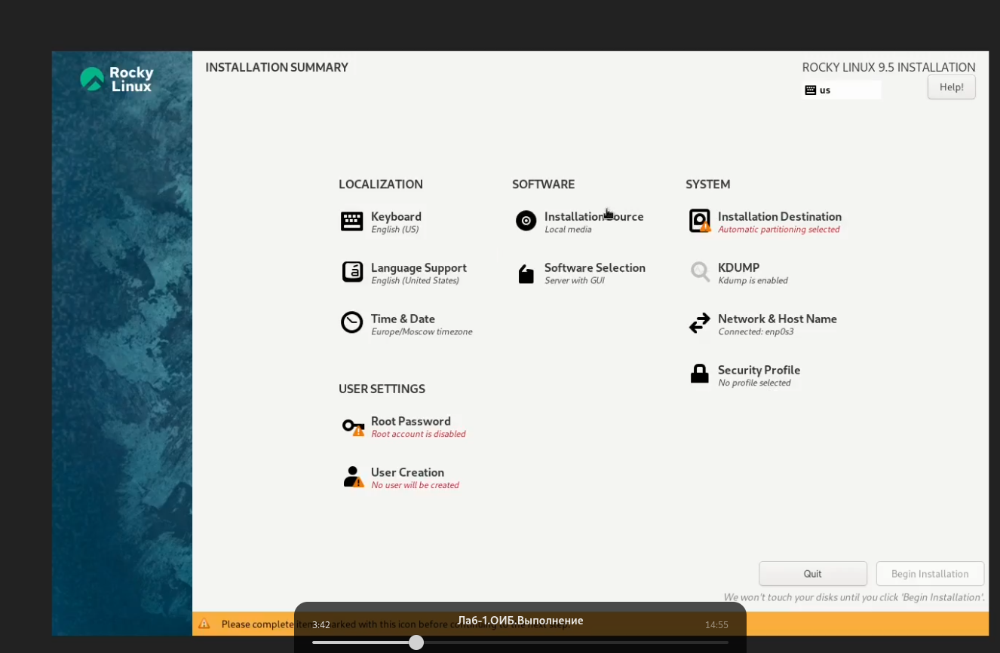
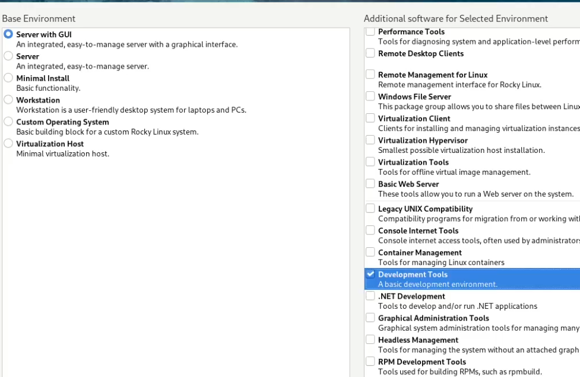
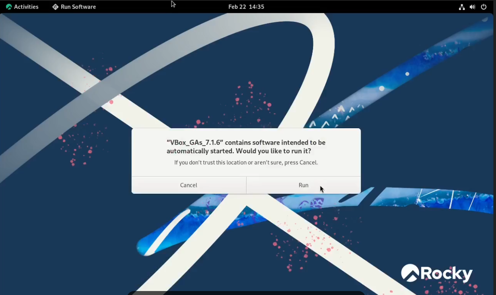
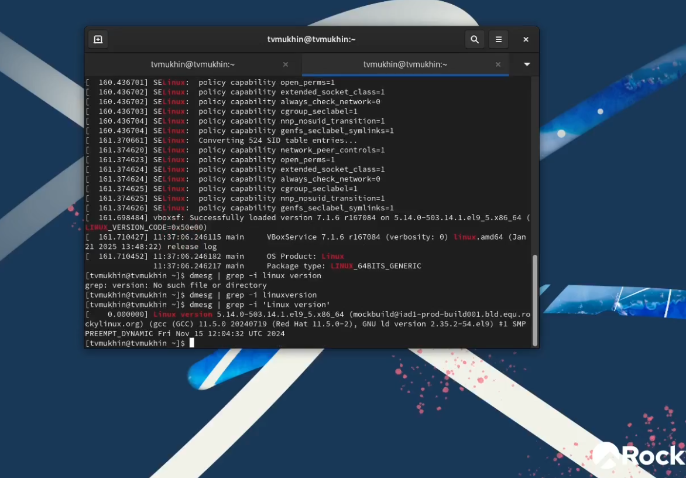

---
## Front matter
lang: ru-RU
title: 'Лабораторная работа №1'
subtitle: 'Установка и конфигурация операционной системы на виртуальную машину'
author:
  - Мухин Тимофей Владимирович (НБИбд-01-23)
institute:
  - Российский университет дружбы народов, Москва, Россия
date: 22.02.2025

## i18n babel
babel-lang: russian
babel-otherlangs: english

## Formatting pdf
toc: false
toc-title: Содержание
slide_level: 2
aspectratio: 169
section-titles: true
theme: metropolis
header-includes:
 - \metroset{progressbar=frametitle,sectionpage=progressbar,numbering=fraction}
 - '\makeatletter'
 - '\beamer@ignorenonframefalse'
 - '\makeatother'
---

# Цель работы

Целью данной работы является приобретение практических навыков установки операционной системы на виртуальную машину, настройки минимально необходимых для дальнейшей работы сервисов.

# Выполнение работы

## Установка VirtualBox

Устанавливаем VirtualBox. Создаем новую виртуальную машину.

{#fig:001 width=70%}

## Настройка виртуальной машины

Настраиваем виртуальную машину (название, тип ОС, объем оперативной памяти, параметры виртуального диска).

{#fig:002 width=70%}

## Добавление привода оптических дисков

Добавляем новый привод оптических дисков и выбираем iso образ дистрибутива Rocky Linux.

{#fig:003 width=70%}

## Настройки установки Rocky Linux

Настройки установки Rocky Linux.

{#fig:004 width=70%}

## Выбор необходимого ПО

Выбор необходимого ПО.

{#fig:005 width=70%}

## Создание пользователя 

Создание пользователя.

{#fig:006 width=70%}

## Подключение образа диска с дополнениями от VirtualBox

Подключение образа диска с дополнениями от VirtualBox.

{#fig:007 width=70%}

## Анализ загрузки системы

Проанализируем последовательность загрузки системы и другие параметры, выполнив команду dmesg.

{#fig:008 width=70%}

# Вывод 

## Вывод

Дистрибутив Rocky Linux был установлен на виртуальную машину VirtualBox для выполнения последующих лабораторных работ.

