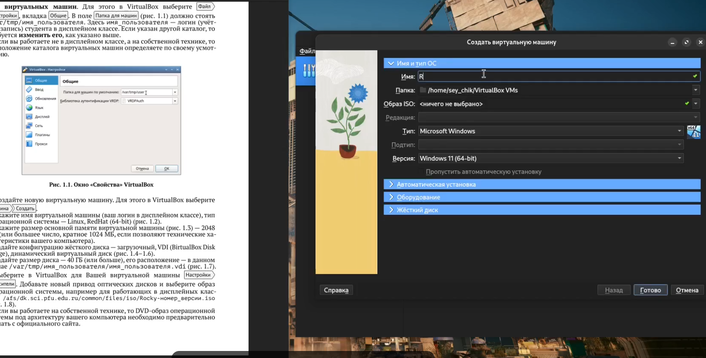
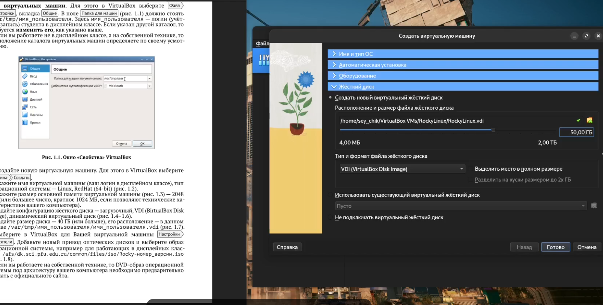
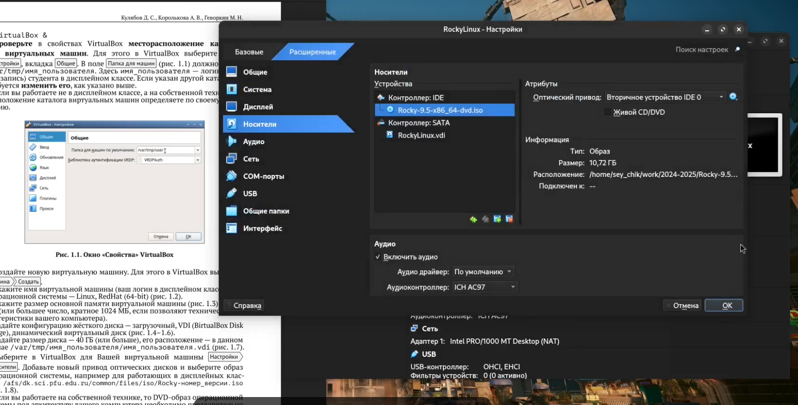
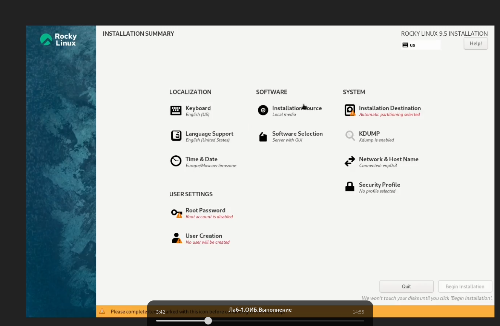
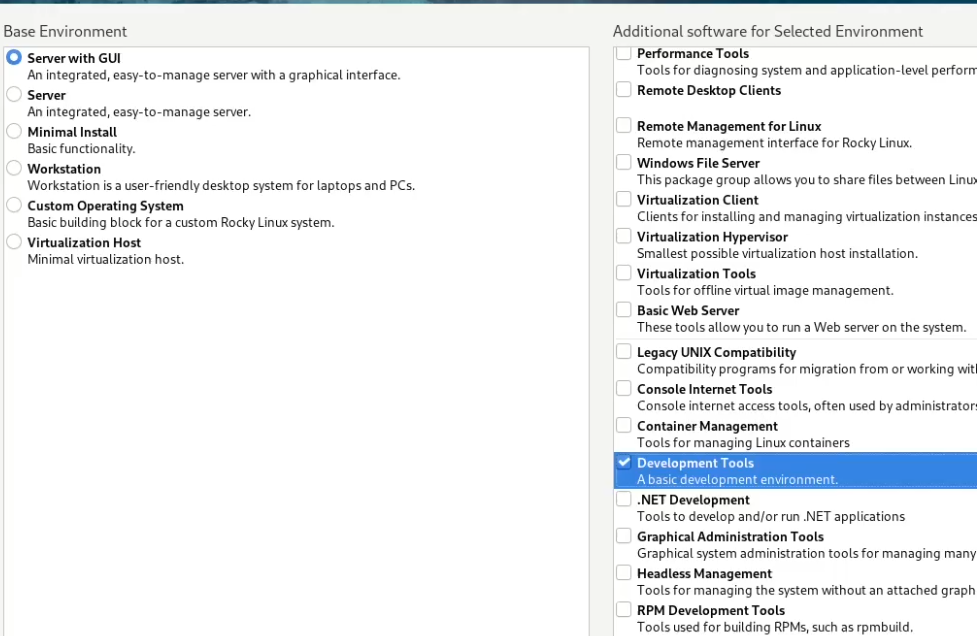
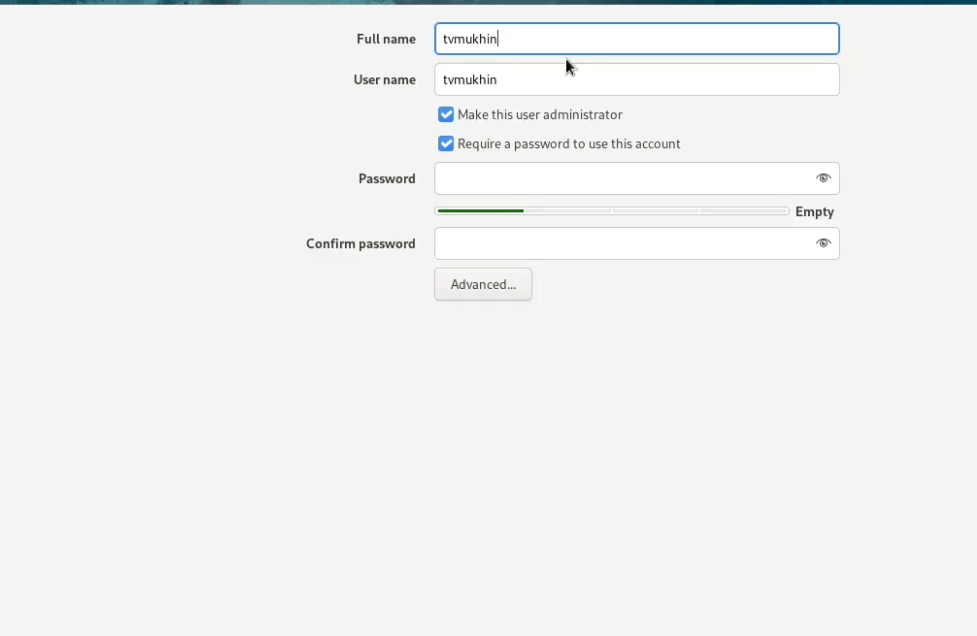
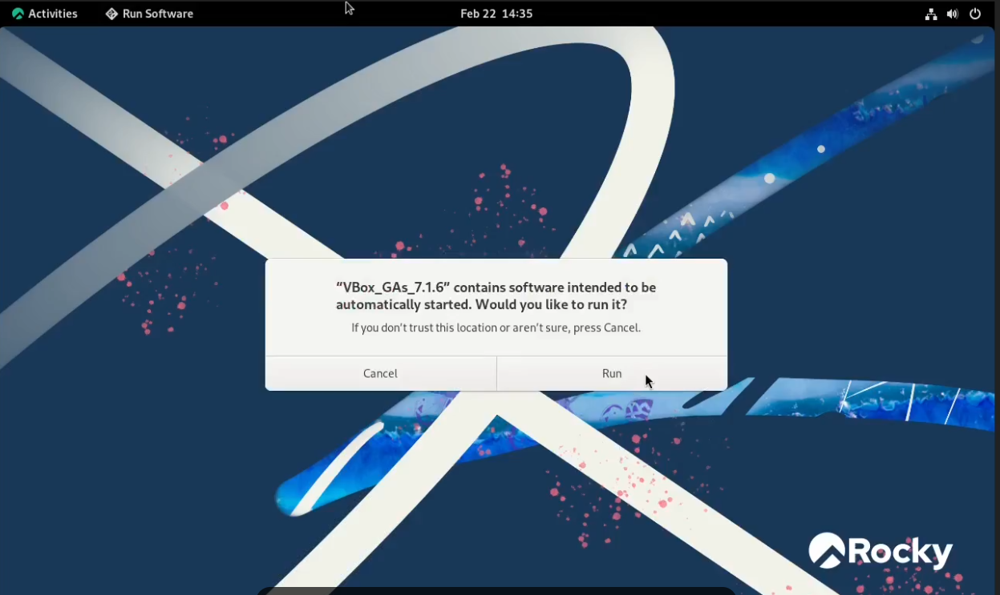
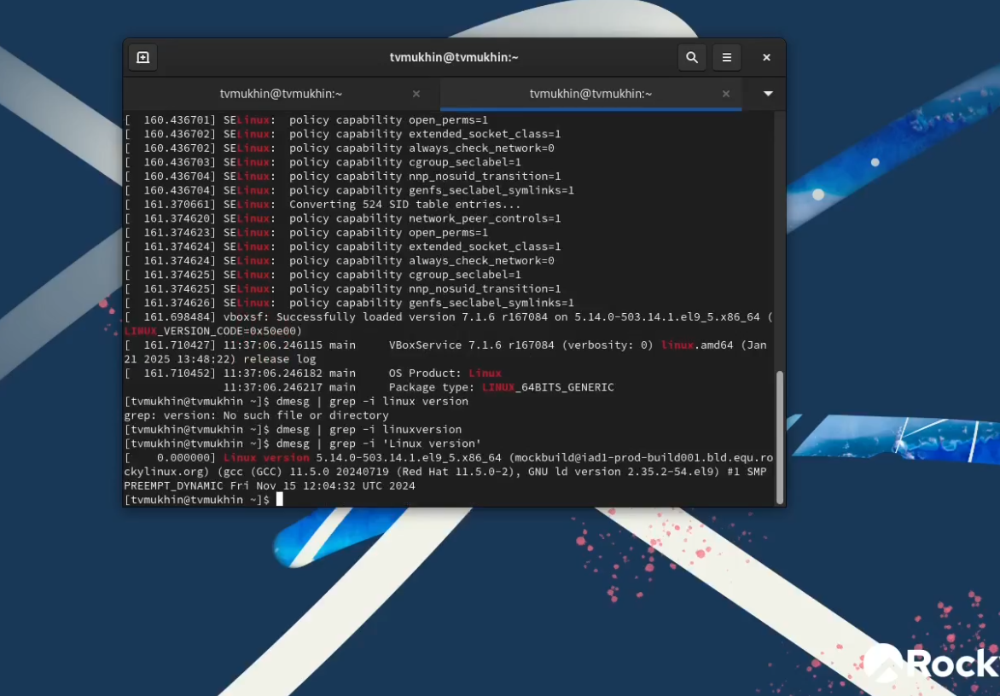

---
## Front matter
title: "Лабораторная работа №1"
subtitle: "Установка и конфигурация операционной системы на виртуальную машину"
author: "Мухин Тимофей Владимирович (НБИбд-01-23)"

## Generic otions
lang: ru-RU
toc-title: "Содержание"

## Bibliography
bibliography: bib/cite.bib
csl: pandoc/csl/gost-r-7-0-5-2008-numeric.csl

## Pdf output format
toc: true # Table of contents
toc-depth: 2
lof: true # List of figures
lot: false # List of tables
fontsize: 12pt
linestretch: 1.5
papersize: a4
documentclass: scrreprt
## I18n polyglossia
polyglossia-lang:
  name: russian
  options:
	- spelling=modern
	- babelshorthands=true
polyglossia-otherlangs:
  name: english
## I18n babel
babel-lang: russian
babel-otherlangs: english
## Fonts
mainfont: IBM Plex Serif
romanfont: IBM Plex Serif
sansfont: IBM Plex Sans
monofont: IBM Plex Mono
mathfont: STIX Two Math
mainfontoptions: Ligatures=Common,Ligatures=TeX,Scale=0.94
romanfontoptions: Ligatures=Common,Ligatures=TeX,Scale=0.94
sansfontoptions: Ligatures=Common,Ligatures=TeX,Scale=MatchLowercase,Scale=0.94
monofontoptions: Scale=MatchLowercase,Scale=0.94,FakeStretch=0.9
mathfontoptions:
## Biblatex
biblatex: true
biblio-style: "gost-numeric"
biblatexoptions:
  - parentracker=true
  - backend=biber
  - hyperref=auto
  - language=auto
  - autolang=other*
  - citestyle=gost-numeric
## Pandoc-crossref LaTeX customization
figureTitle: "Рис."
tableTitle: "Таблица"
lofTitle: "Список иллюстраций"
lotTitle: "Список таблиц"
lolTitle: "Листинги"
## Misc options
indent: true
header-includes:
  - \usepackage{indentfirst}
  - \usepackage{float} # keep figures where there are in the text
  - \floatplacement{figure}{H} # keep figures where there are in the text
---

# Цель работы

Целью данной работы является приобретение практических навыков
установки операционной системы на виртуальную машину, настройки ми-
нимально необходимых для дальнейшей работы сервисов.

# Выполнение лабораторной работы

1. Устанавливаем VirtualBox. Создаем новую виртуальную машину.

{#fig:001 width=70%}

2. Настраиваем виртуальную машину (название, тип ОС, объем оперативной памяти, параметры виртуального диска)

{#fig:002 width=70%}

3. Добавляем новый привод оптических дисков и выбираем iso образ дистрибутива Rocky Linux.

{#fig:003 width=70%}

4. Настройки установки Rocky Linux

{#fig:004 width=70%}

5. Выбор необходимого ПО

{#fig:005 width=70%}

6. Создание пользователя 

{#fig:006 width=70%}

7. Подключение образа диска с дополнениями от VirtualBox

{#fig:007 width=70%}

8. Проанализируем последовательность загрузки системы и другие параметры, выполнив команду dmesg

{#fig:008 width=70%}

# Вывод

Дистрибутив Rocky Linux был установлен на виртуальную машину VirtualBox для выполнения последующих лабораторных работ.

# Контрольные вопросы

## 1. Информация в учётной записи пользователя
- Имя пользователя
- Пароль
- Уровень доступа (права)
- Настройки профиля
- Персональные данные (например, email)

## 2. Команды терминала
- **Получение справки по команде:**
  - `man <команда>` (например, `man ls`)
  
- **Перемещение по файловой системе:**
  - `cd <путь>` (например, `cd /home/user`)

- **Просмотр содержимого каталога:**
  - `ls` (например, `ls -l`)

- **Определение объёма каталога:**
  - `du -sh <каталог>` (например, `du -sh /home/user`)

- **Создание / удаление каталогов / файлов:**
  - Создание: `mkdir <каталог>` (например, `mkdir new_folder`)
  - Удаление: `rm <файл>` (например, `rm file.txt`)

- **Задание прав на файл / каталог:**
  - `chmod <права> <файл>` (например, `chmod 755 script.sh`)

- **Просмотр истории команд:**
  - `history`

## 3. Файловая система
Файловая система — это способ организации и хранения файлов на носителе. Примеры:
- **NTFS**: Используется в Windows, поддерживает большие файлы и права доступа.
- **ext4**: Широко используется в Linux, обеспечивает высокую производительность и надежность.
- **FAT32**: Поддерживается многими ОС, но имеет ограничения по размеру файлов.
- **Btrfs**: Современная файловая система для Linux, поддерживает снимки, сжатие и управление объемом.

## 4. Просмотр подмонтированных файловых систем
- `df -h` (показывает список подмонтированных файловых систем и их использование)

## 5. Удаление зависшего процесса
- `kill <PID>` (например, `kill 1234`)
- Если процесс не реагирует: `kill -9 <PID>` (например, `kill -9 1234`)

