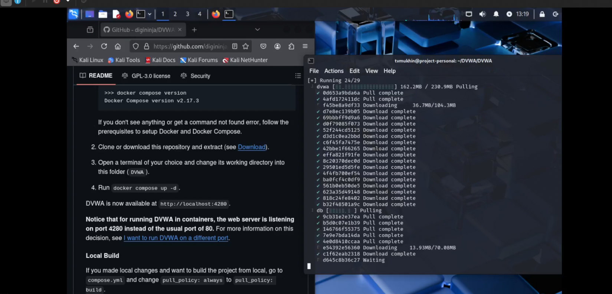

---
## Front matter
lang: ru-RU
title: Индивидуальный проект
subtitle: Этап 2. Установка DVWA
author:
  - Мухин Тимофей
institute:
  - Российский университет дружбы народов, Москва, Россия
date: 22.03.2025

## i18n babel
babel-lang: russian
babel-otherlangs: english

## Formatting pdf
toc: false
toc-title: Содержание
slide_level: 2
aspectratio: 169
section-titles: true
theme: metropolis
header-includes:
 - \metroset{progressbar=frametitle,sectionpage=progressbar,numbering=fraction}
 - '\makeatletter'
 - '\beamer@ignorenonframefalse'
 - '\makeatother'
---

# Цель работы

## Цель работы
Установить DVWA в гостевую систему к Kali Linux.
Репозиторий: https://github.com/digininja/DVWA.

# Выполнение работы

## Выполнение работы

Изучаем информацию по установке DVWA в docker контейнер

{#fig:001 width=70%}

## Выполнение работы

Устанавливаем Docker и Docker-compose на Kali Linux

{#fig:001 width=70%}
 
## Выполнение работы

Устанавливаем Docker и Docker-compose на Kali Linux

{#fig:001 width=70%}

## Выполнение работы

Клонируем репозиторий с DVWA и запускаем контейнер с DVWA. Будет доступен веб-интерфейс на localhost

{#fig:001 width=70%}

## Выполнение работы

Первичный запуск настройка DVWA

{#fig:001 width=70%}

# Вывод

## Вывод

В ходе выполнения этапа 2 индивидуального проекта было установлено DVWA
