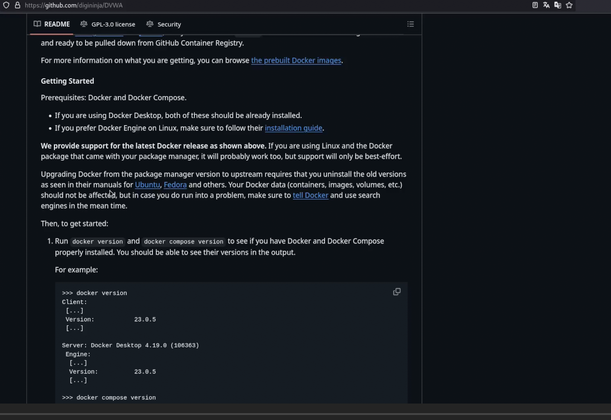
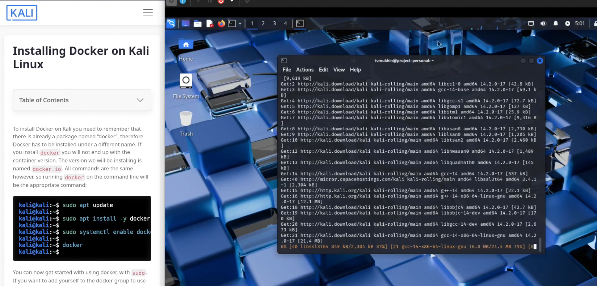
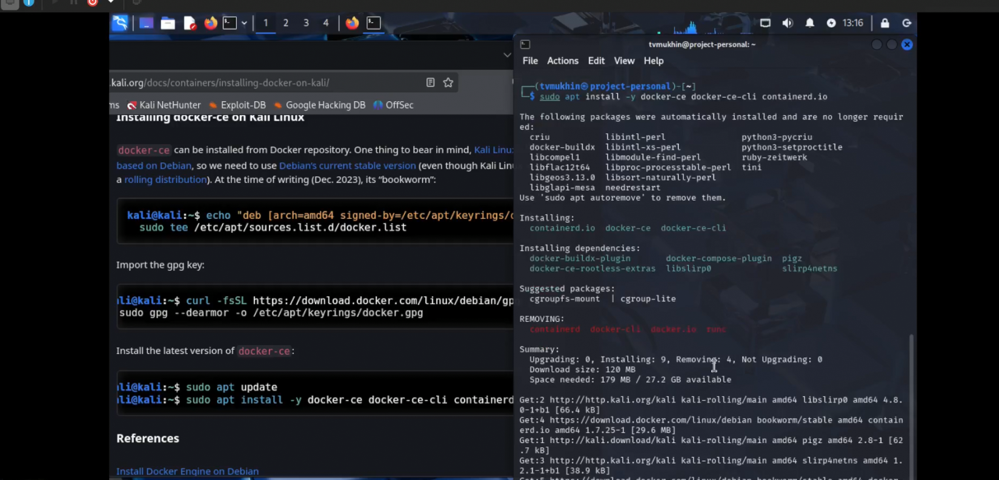
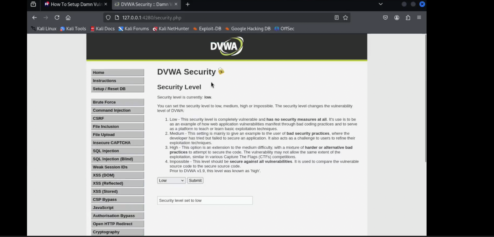

---
## Front matter
title: "Индивидуальный проект"
subtitle: "Этап 2. Установка DVWA"
author: "Мухин Тимофей Владимирович"

## Generic otions
lang: ru-RU
toc-title: "Содержание"

## Bibliography
bibliography: bib/cite.bib
csl: pandoc/csl/gost-r-7-0-5-2008-numeric.csl

## Pdf output format
toc: true # Table of contents
toc-depth: 2
fontsize: 12pt
linestretch: 1.5
papersize: a4
documentclass: scrreprt
## I18n polyglossia
polyglossia-lang:
  name: russian
  options:
	- spelling=modern
	- babelshorthands=true
polyglossia-otherlangs:
  name: english
## I18n babel
babel-lang: russian
babel-otherlangs: english
## Fonts
mainfont: PT Serif
romanfont: PT Serif
sansfont: PT Sans
monofont: PT Mono
mainfontoptions: Ligatures=TeX
romanfontoptions: Ligatures=TeX
sansfontoptions: Ligatures=TeX,Scale=MatchLowercase
monofontoptions: Scale=MatchLowercase,Scale=0.9
## Biblatex
biblatex: true
biblio-style: "gost-numeric"
biblatexoptions:
  - parentracker=true
  - backend=biber
  - hyperref=auto
  - language=auto
  - autolang=other*
  - citestyle=gost-numeric
## Pandoc-crossref LaTeX customization
figureTitle: "Рис."
tableTitle: "Таблица"
listingTitle: "Листинг"
lolTitle: "Листинги"
## Misc options
indent: true
header-includes:
  - \usepackage{indentfirst}
  - \usepackage{float} # keep figures where there are in the text
  - \floatplacement{figure}{H} # keep figures where there are in the text
---

# Цель работы


    Установите DVWA в гостевую систему к Kali Linux.
    Репозиторий: https://github.com/digininja/DVWA.
    Некоторые из уязвимостей веб приложений, который содержит DVWA:
    Брутфорс: Брутфорс HTTP формы страницы входа - используется для 
тестирования инструментов по атаке на пароль методом грубой силы и 
показывает небезопасность слабых паролей.
    Исполнение (внедрение) команд: Выполнение команд уровня операционной системы.
    Межсайтовая подделка запроса (CSRF): Позволяет «атакующему»
 изменить пароль администратора приложений.
     Внедрение (инклуд) файлов: Позволяет «атакующему» присоединить 
удалённые/локальные файлы в веб приложение.
    SQL внедрение: Позволяет «атакующему» внедрить SQL выражения
 в HTTP из поля ввода, DVWA включает слепое и основанное на ошибке SQL внедрение.
    Небезопасная выгрузка файлов: Позволяет «атакующему» выгрузить
 вредоносные файлы на веб сервер.
    Межсайтовый скриптинг (XSS): «Атакующий» может внедрить свои 
скрипты в веб приложение/базу данных. DVWA включает отражённую и хранимую XSS.
    Пасхальные яйца: раскрытие полных путей, обход 
аутентификации и некоторые другие.
    DVWA имеет три уровня безопасности, они меняют 
уровень безопасности каждого веб приложения в DVWA:
    Невозможный — этот уровень должен быть безопасным 
от всех уязвимостей. Он используется для сравнения 
уязвимого исходного кода с безопасным исходным кодом.
    Высокий — это расширение среднего уровня сложности, со 
смесью более сложных или альтернативных плохих практик в попытке обезопасить код. 
Уязвимости не позволяют такой простор эксплуатации как на других уровнях.
    Средний — этот уровень безопасности предназначен 
главным образом для того, чтобы дать пользователю пример 
плохих практик безопасности, где разработчик попытался сделать приложение
 безопасным, но потерпел неудачу.
    Низкий — этот уровень безопасности совершенно уязвим 
и совсем не имеет защиты. Его предназначение быть примером среди уязвимых 
веб приложений, примером плохих практик программирования и служить платформой обучения базовым техникам эксплуатации.


# Выполнение работы

1. Изучаем информацию по установке DVWA в docker контейнер

{#fig:001 width=70%}


2. Устанавливаем Docker и Docker-compose на Kali Linux

{#fig:001 width=70%}

{#fig:001 width=70%}

3. Клонируем репозиторий с DVWA и запускаем контейнер с DVWA. Будет доступен веб-интерфейс на localhost
```
docker compose up -d
```

{#fig:001 width=70%}


4. Первичный запуск настройка DVWA

{#fig:001 width=70%}


# Выводы

В ходе этапа 2 индивидуального проекта было установлено DVWA


